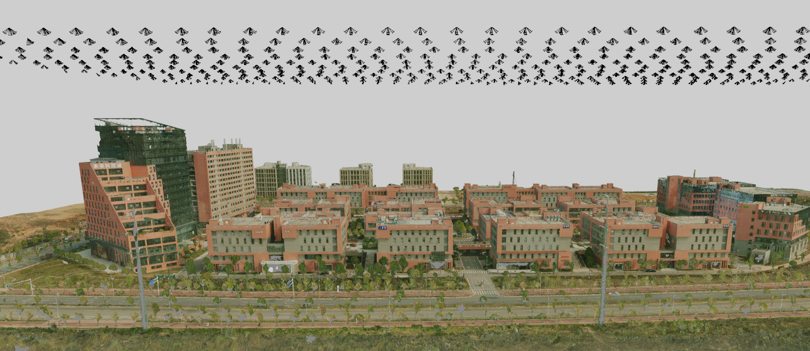

<p align="center">
  <a href="https://github.com/Choyaa/SensLoc"></a>
</p>
## Installation

SensLoc is built with Python >=3.6 and PyTorch. The package `SensLoc` includes code for both training and evaluation. Installing the package locally also installs the minimal dependencies listed in `requirements.txt`:

``` bash
git clone https://github.com/Choyaa/SensLoc
cd SensLoc/
pip install -e .
```
The default structure is as follows:
```
SensLoc
.
├── asserts
├── datasets
├── notebooks
│   └── pipeline
├── outputs
├── README.md
├── requirements.txt
├── sensloc
│   ├── hloc
│   ├── localization
│   ├── pipelines
│   ├── senslib
│   ├── utils
│   │   ├── blender
│   │   │   ├── db_depth.py
│   │   │   ├── db_rgb.py
│   │   │   ├── dji_depth.py
│   │   │   ├── dji_rgb.py
│   │   │   ├── obj_loader.py
│   │   │   ├── phone_depth.py
│   │   │   ├── phone_rgb.py
│   │   │   └── render.bat
│   │   ├── colmap
│   │   │   ├── __init__.py
│   │   │   ├── read_write_model.py
│   │   │   └── visualize_model.py
│   │   └── preprocess
│   │       ├── read_rtk.py
│   │       ├── video_frame_extraction.py
│   │       └── xml_read_scale.py
│   └── visualization
│       ├── depth_vis.py
│       └── matches_vis.py
├── setup.py
└── weights
```

